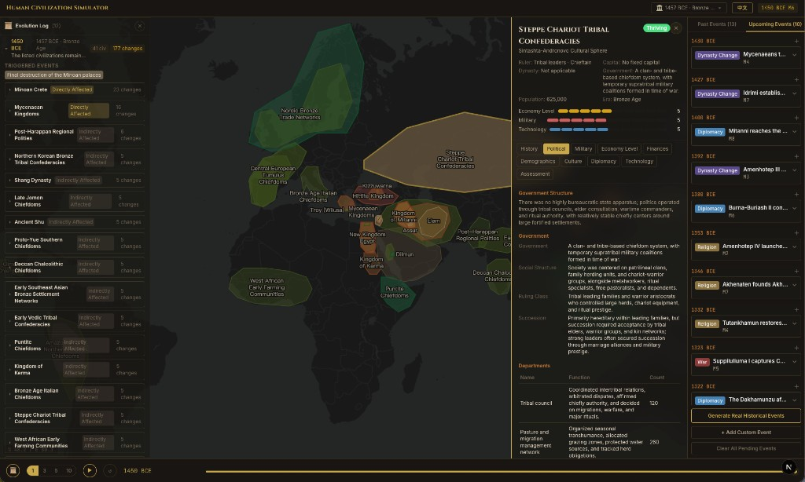

# Human History Simulator

[](https://nextjs.org/)
[](https://react.dev/)
[](https://www.typescriptlang.org/)
[](./LICENSE)
[](https://github.com/your-username/human-history-simulator/pulls)

> _If you had the power to rewrite history, where would you take humanity?_

**Human History Simulator** is a civilization simulation powered by an LLM-based multi-agent system as its historical reasoning engine. Choose from **20 eras** spanning **3,600+ years**, from the Bronze Age forges of 1600 BCE through the rise and fall of empires to the AI revolution of 2023 CE, and set **1,400+ civilizations** in motion on an interactive world map. Each civilization is a deeply modeled entity tracking **100+ state fields**: GDP, military strength, literacy, trade routes, cultural output, and far more. Every turn, the multi-agent engine — including a **strategic civilization agent** that gives each nation its own goals — weaves new events, computes state transitions, and reshapes the geopolitical landscape. No two playthroughs are ever the same.

<p align="center">
  
</p>

Territory boundaries are drawn from **47 real historical GeoJSON snapshots** (2000 BCE – 2010 CE) built on open academic basemaps: actual scholarly boundary data, not approximations. Wars redraw borders. Trade routes shift wealth across continents. Plagues decimate populations. Inventions ignite revolutions. The newest era, **AI Age (2023)**, drops you into the dawn of the artificial intelligence revolution: the foundation model race, chip export controls, AI regulation battles, and the geopolitical realignment they trigger. Every mutation is logged at field-level granularity, giving you a god's-eye view of cause and effect across millennia. Same starting conditions, endlessly divergent histories.

[English](./README.md) · [中文](./README.zh-CN.md)

## Highlights

- **[20 Historical Eras](#supported-eras)** covering Bronze Age through the AI Age, each seeded with historically accurate civilizations, rulers, and geopolitical configurations.
- **1,400+ Civilizations** including empires, kingdoms, city-states, tribes, and trade networks, with 60 to 100 regions simulated per era.
- **Multi-Agent Evolution** where an AI orchestrator clusters regions, generates events, and computes per-field state transitions across economy, military, diplomacy, culture, and more.
- **Civilization Agent** giving key regions strategic intent — expand, defend, trade, invest in tech, forge alliances — so nations behave like nations, not passive data.
- **Real Historical Boundaries** from 47 GeoJSON boundary snapshots sourced from open academic basemaps, spanning 4,000 years of territorial change.
- **Interactive World Map** with territory overlays, hover inspection, and click-to-detail for every civilization.
- **Deep Civilization Profiles** with 10 dimension tabs per region and 100+ tracked fields: rulers, government departments, GDP, trade goods, military branches, demographics, cultural achievements, and more.
- **War System** providing structured conflict tracking with belligerents, casus belli, strategic advantages, and post-war impact.
- **Threshold-Triggered Events** that auto-generate crises and breakthroughs when key metrics cross critical thresholds — economic collapse, military escalation, tech revolutions, population crises, and alliance breakdowns.
- **Custom Events** that let you inject any scenario and watch the AI react — change a single invention's timing, unleash a plague, rewrite a discovery.
- **Dual Simulation Modes**: Historical mode grounds the simulation in documented events; Speculative mode unlocks civilization memory and scenario injection for deep alternate-history exploration.
- **Time Control** with play, pause, step, advance-by-epoch, and rollback to any year.
- **Bilingual** with full English & Chinese UI and localized civilization data.

## How It Works

History doesn't happen in isolation. A war in one region sends refugees across borders, disrupts trade routes, and emboldens rivals on the other side of the continent. The simulation engine is designed around this principle: **everything is connected**.

### The Simulation Loop

When you press play or advance the clock, three things happen in sequence:

1. **Events shape the world.** The engine looks at the upcoming events on your timeline and asks: which civilizations are affected? A famine in Egypt, a trade treaty between Venice and Constantinople, a Mongol invasion sweeping across Central Asia. Each event names the regions it touches and the kind of change it brings.

2. **Civilizations respond together.** Regions that share the same events, fight the same wars, or border each other are grouped and reasoned about as a whole. This ensures that when the Ottoman Empire expands, the Byzantine reaction, Egyptian trade shifts, and Venetian diplomatic maneuvers are all computed in the same context, not in isolation. Regions with no connection to current events evolve on their own internal logic.

3. **The world updates.** Every change, from a population shift to a new ruler to a GDP fluctuation, is recorded as a precise field-level delta. Nothing is overwritten wholesale. You can trace exactly what changed, why, and how it rippled outward, all visible in the History tab and Evolution Log.

### Where Do Events Come From?

Before the simulation can move forward, it needs to know **what happens next**. Events enter the timeline through four channels:

- **Prebuilt historical events.** Each era ships with a curated set of real, documented events. When you start the Bronze Age, you'll see the fall of Mycenae, the Sea Peoples' invasions, and the rise of the Zhou Dynasty already queued up, grounding the simulation in real history from the first turn.

- **AI-generated events.** Click "Generate Real Historical Events" and the AI will research the current world state, consider which regions exist and what has happened recently, then produce documented historical events for the years ahead. Events stream into the "Upcoming Events" panel in real time as they're generated.

- **Threshold-triggered events.** The engine monitors every civilization's vital signs — GDP, military posture, technology level, population, and alliances. When a metric crosses a critical threshold (a 30% GDP crash, a sudden military surge during conflict, a tech level breakthrough), the system automatically injects a corresponding event. These emergent crises and breakthroughs make the simulation feel alive even when no one is writing new events.

- **Custom events.** Write any scenario you want: "The printing press is invented 500 years early," "A plague wipes out 30% of Rome's population," or "China discovers the Americas in 1421." Custom events are created through a dedicated editor with title, description, date, category, and affected regions, and are treated exactly like real events by the engine — letting you reshape history and watch the consequences unfold.

### The Design Philosophy

The core idea is simple: **the AI doesn't write a story; it computes consequences.** Given a set of events and the current state of every civilization, the engine figures out what would plausibly happen next across dozens of dimensions simultaneously. The result feels emergent rather than scripted, because it is. Two playthroughs of the same era will diverge almost immediately, not because of randomness, but because small differences in event timing and sequencing cascade through interconnected systems in unpredictable ways.

## Getting Started

### Prerequisites

- **Node.js** ≥ 18
- An **[OpenRouter](https://openrouter.ai/)** API key (can be set via `.env.local` or entered in the app)

### Install & Run

```bash
git clone https://github.com/your-username/human-history-simulator.git
cd human-history-simulator
npm install
```

Create `.env.local` (optional — you can also enter your API key in Settings):

```env
OPENROUTER_API_KEY=your_openrouter_api_key_here
LLM_MODEL=openai/gpt-5.4
LLM_MAX_GROUP_SIZE=10
```

| Variable             | Description                                    |
| -------------------- | ---------------------------------------------- |
| `OPENROUTER_API_KEY` | Your OpenRouter API key                        |
| `LLM_MODEL`          | Model for simulation (any model on OpenRouter) |
| `LLM_MAX_GROUP_SIZE` | Max regions per LLM call                       |

```bash
npm run dev
```

Open [http://localhost:3000](http://localhost:3000). If no API key is configured in `.env.local`, the Welcome screen will prompt you to enter and validate one. Pick an era and start simulating.

## Scripts

| Command                      | Description                    |
| ---------------------------- | ------------------------------ |
| `npm run dev`                | Development server             |
| `npm run build`              | Production build               |
| `npm run start`              | Production server              |
| `npm run lint`               | ESLint                         |
| `npm run seed`               | Seed database with default era |
| `npm run seed -- bronze-age` | Seed with a specific era       |
| `npm run generate:eras`      | Generate era data via LLM      |

## Supported Eras

|     | Era                       | Year     | Description                                                                                                                                         |
| --- | ------------------------- | -------- | --------------------------------------------------------------------------------------------------------------------------------------------------- |
| 🤖  | **AI Age**                | 2023 CE  | ChatGPT ignites AI revolution, foundation model race in full swing, chip export controls reshape supply chains, nations racing to set AI strategies |
| 🌐  | **Modern World**          | 2000 CE  | Turn of millennium, Internet age dawning, globalization accelerating, China joining WTO                                                             |
| ☢️  | **Cold War Era**          | 1962 CE  | Cuban Missile Crisis, US-Soviet confrontation, decolonization wave, Space Race intensifying                                                         |
| 💥  | **World War Era**         | 1939 CE  | WWII begins, Nazi Germany expanding, Japan invading China, Soviet Union preparing, USA neutral but soon to join                                     |
| 🌍  | **Age of Imperialism**    | 1900 CE  | British Empire at zenith, USA rising, Meiji Japan industrialized, Scramble for Africa complete                                                      |
| 🏭  | **Industrial Revolution** | 1840 CE  | Opium War begins, Victorian Britain, Industrial Revolution transforming the world, Japan approaching Meiji Restoration                              |
| 💡  | **Age of Enlightenment**  | 1750 CE  | Qing Dynasty Qianlong era, European Enlightenment at peak, eve of French Revolution, Industrial Revolution beginning                                |
| 🔭  | **Early Modern Period**   | 1648 CE  | Thirty Years' War ends, Westphalian system established, early Qing Dynasty, Scientific Revolution underway                                          |
| 🎨  | **Renaissance**           | 1500 CE  | Ming Dynasty thriving, Ottoman Empire at peak, European Renaissance, Age of Exploration begins                                                      |
| 🏇  | **Mongol Empire**         | 1280 CE  | Yuan Dynasty rules China, Mongol Empire spans Eurasia, Marco Polo visits China, Delhi Sultanate resists Mongols                                     |
| ⚜️  | **Age of Crusades**       | 1200 CE  | Southern Song in China, Mongol Empire about to rise, Crusades continuing, Kamakura Shogunate in Japan                                               |
| 🌸  | **Tang Golden Age**       | 750 CE   | Tang Dynasty at apex before An Lushan Rebellion, Abbasid Caliphate just established, Carolingian Empire emerging                                    |
| 🏚️  | **Fall of Rome**          | 476 CE   | Western Roman Empire fallen, Northern and Southern Dynasties in China, Byzantine Empire endures, barbarian kingdoms emerge                          |
| 🐉  | **Three Kingdoms**        | 220 CE   | Wei, Shu, Wu competing, Roman Empire in Third Century Crisis, Sassanid Persia rising, Gupta Empire emerging                                         |
| 🛣️  | **Twin Empires**          | 100 CE   | Eastern Han at peak, Roman Empire under Trajan, Silk Road thriving, Kushan Empire bridging East and West                                            |
| 👑  | **Qin-Han & Rome**        | 221 BCE  | Qin Shi Huang unifies China, Roman Republic expanding, Punic Wars ongoing, Maurya Empire at peak                                                    |
| 🏛️  | **Hellenistic Period**    | 323 BCE  | Alexander the Great just died, empire fragmenting, Warring States era in China, Maurya Empire unifying India                                        |
| 🧘  | **Axial Age**             | 500 BCE  | Age of Confucius and Laozi, Persian Empire at peak, Greek democracy established, Buddha teaching in India                                           |
| ⚔️  | **Iron Age**              | 800 BCE  | Late Western Zhou, Assyrian Empire dominant, Greek city-states emerging, Phoenicians trading across Mediterranean                                   |
| 🏺  | **Bronze Age**            | 1600 BCE | Shang Dynasty founded, Babylonian Empire at peak, Egyptian New Kingdom rising, Mycenaean civilization flourishing                                   |

## Roadmap

**Engine & Controls**

- [ ] **Tunable Simulation Engine**: Optimize progression efficiency and expose a control panel for shaping how history unfolds — adjust _contingency_ vs. _determinism_ to set the balance between butterfly effects and structural forces, tune event-category weights (war, diplomacy, trade, tech, culture, disaster) to amplify or suppress specific drivers, and compare divergence across parallel runs to see exactly where and why timelines split.
- [ ] **Richer Custom Events**: Make custom-event injection more expressive: chain events together, set preconditions, and craft elaborate alternate-history scenarios with branching consequences.
- [ ] **Live State Editor**: Directly modify any civilization's state at any point in time — tweak GDP, swap rulers, redraw alliances, adjust military strength — and watch the engine propagate consequences forward.

**Content & Data**

- [ ] **Deeper Civilization Profiles**: Enrich per-civilization modeling with finer-grained dimensions: social structure, religious influence, artistic movements, philosophical currents, collective morale, infrastructure, and more — making culture and spirit first-class simulation axes alongside economics and military.
- [ ] **Historical Economics & Asset Tracking**: Ground each era's economy in real research — trade volumes, monetary systems, taxation, debt, wealth distribution — and model key asset trajectories (gold, silver, grain, oil, land, proto-equity instruments) as interactive trend charts that evolve alongside the simulation.
- [ ] **Broader Historical Coverage**: Surface overlooked but historically significant states, tribes, and regions on the map. The ones textbooks forget, but history remembers.
- [ ] **Future Era Projection**: Push the timeline beyond the AI Age — 2030, 2050, 2100 and further — and let the engine speculate on AGI, autonomous weapons, space colonization, climate tipping points, and the global order they reshape.

**Gameplay Modes**

- [ ] **Historical Scenarios**: Deep-dive into pivotal turning points through curated packs that advance **month by month**. Let players experience decisions, crises, and cascading consequences at a granular, almost first-person level, and observe how local shocks reshape the global balance of power. Prioritize five thematic tracks:
  - **Politics**: Glorious Revolution (1688-1689), French Revolution (1789-1799), American War of Independence (1775-1783), Xinhai Revolution (1911-1912), Meiji Restoration (1868-1877)
  - **Nature**: Black Death spread across Eurasia (1347-1353), the Tambora eruption and the "Year Without a Summer" (1815-1816), Yellow River course shifts and North China famine cascades (1855-1879)
  - **Humanities**: Renaissance city networks (1450-1520), Reformation vs. Counter-Reformation (1517-1648), Enlightenment salons and print diffusion (1715-1789)
  - **Technology**: steam-engine diffusion and railway races (1769-1914), telegraph-era global information networks (1837-1914), early nuclear-age arms and diplomacy (1945-1968)
  - **Finance**: Tulip Mania (1636-1637), the South Sea and Mississippi bubbles (1720), the Great Depression with gold-standard shocks (1929-1933), the Asian Financial Crisis (1997-1998)
- [ ] **Role-Play Mode**: Let players embody any notable historical figure — a monarch, party chairman, field marshal, company founder, and more. Enter history from a concrete personal perspective: read the shifting landscape, set strategic goals, and make pivotal decisions that shape both your own trajectory and wider world outcomes.
- [ ] **War Impact Visualization**: Go beyond event logs — visualize in real time how conflict redraws borders, shifts populations, disrupts economies, and tilts the balance of power.

**Integration**

- [ ] **Skill-Based Agent Integration**: Expose the simulator as a set of Skills so autonomous agents (e.g. from OpenClaw) can take over the human role — selecting eras, injecting events, making strategic decisions, and driving the simulation forward without manual interaction.

## Acknowledgments

- **[aourednik/historical-basemaps](https://github.com/aourednik/historical-basemaps)**: Open-source historical world map boundaries (GeoJSON) from 2000 BCE to 2010 CE by André Ourednik. This project's territory visualization is built upon these academic basemaps, simplified and matched to our internal region system. We are deeply grateful for this invaluable open dataset that makes historical boundary rendering possible.
- **[OpenRouter](https://openrouter.ai/)**: Unified LLM API gateway that powers the simulation engine.
- **[MapLibre GL](https://maplibre.org/)**: Open-source map rendering library.

## Contributing

Contributions are welcome! Feel free to open issues or submit pull requests.

## License

MIT
