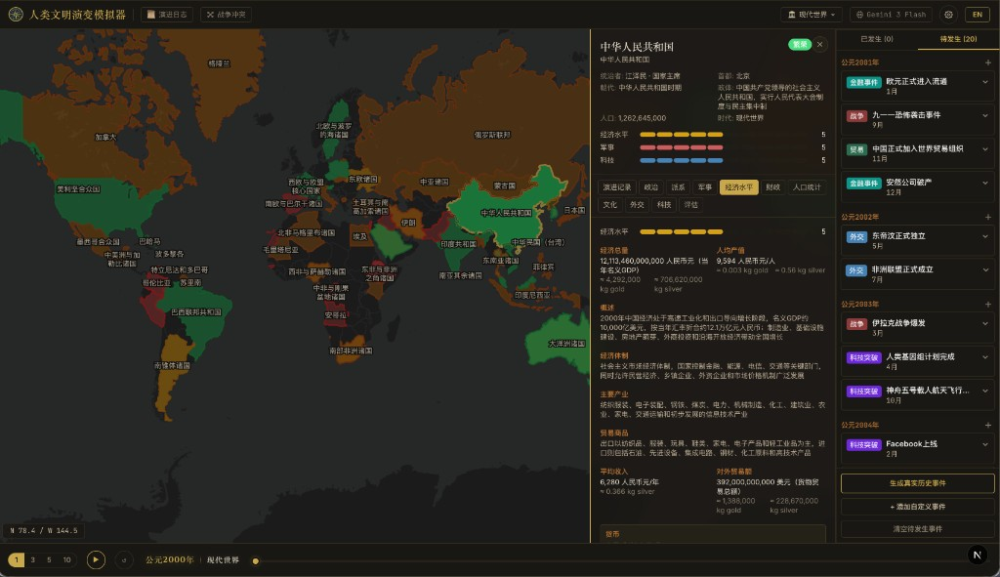

# Human History Simulator

[](https://nextjs.org/)
[](https://react.dev/)
[](https://www.typescriptlang.org/)
[](./LICENSE)
[](https://github.com/your-username/human-history-simulator/pulls)

> _如果你能改写历史，你会把人类引向何方？_

**Human History Simulator** 是一款由 LLM 多 Agent 驱动的文明推演模拟器。**20 个纪元**任你选择，时间跨度超过 **3,600 年**——从公元前 1600 年的青铜熔炉，历经帝国兴衰更替，直到 2023 年的 AI 革命。**1,400+ 文明**在交互式世界地图上同时运转，每个文明都经过深度建模，追踪 **100+ 项状态指标**：GDP、军事实力、识字率、贸易路线、文化产出，不一而足。每一回合，多 Agent 推演引擎协同工作——其中**文明决策 Agent** 赋予每个国家独立的战略意志——生成新事件、计算状态变迁、重塑地缘格局。同一个起点，每次推演都通往不同的历史。

<p align="center">
  
</p>

疆域边界取自 **47 组真实历史 GeoJSON 快照**（公元前 2000 年 – 公元 2010 年），基于开源学术地图构建——这是经过考据的学术疆域数据，而非粗略近似。战争改写疆界，贸易路线在大陆间搬运财富，瘟疫吞噬人口，发明点燃变革。最新纪元 **AI 时代（2023）** 把你带到人工智能革命的前夜：大模型军备竞赛、芯片出口管制、AI 监管角力，以及由此掀起的地缘洗牌。每一次变化都以字段级粒度留档，让你以上帝视角纵览千年因果。相同起点，无限分叉。

[English](./README.md) · [中文](./README.zh-CN.md)

## 亮点

### 世界与文明

- **[20 个历史纪元](#支持的纪元)** —— 从青铜时代（前 1600 年）到 AI 时代（2023 年），每个纪元均预置了符合史实的文明、统治者与地缘格局。
- **1,400+ 文明** —— 帝国、王国、城邦、部落、贸易网络悉数囊括，每个纪元同时模拟 60–100 个区域。
- **真实历史疆域** —— 47 组 GeoJSON 疆域快照，源自开源学术地图，涵盖 4,000 年领土变迁。

### AI 引擎

- **多 Agent 协同推演** —— AI 编排器将区域聚类、生成事件，并在经济、军事、外交、文化等维度逐字段计算状态变迁。
- **文明决策 Agent** —— 为关键区域注入战略意志：扩张、防御、通商、投资科技、结盟斡旋——让国家像国家一样思考，而非被动的数据容器。
- **文明记忆** —— 在推演模式下保留每个国家的长期目标与历史决策，使其在多轮推演中表现出连贯的战略行为。
- **阈值触发事件** —— 当关键指标越过临界值，系统自动生成危机或突破：经济崩盘、军备升级、科技飞跃、人口危机、同盟瓦解。

### 经济与市场

- **经济模拟引擎** —— 独立于 LLM 回合，基于索洛模型推演 GDP 增长、马尔萨斯人口模型、税收平滑与债务动态、基尼系数变化。
- **资产定价引擎** —— 追踪历史商品（黄金、白银、粮食、土地、石油、股票、加密货币），支持事件驱动的波动率、冲击（崩盘、繁荣、泡沫、货币危机）及种子随机数。
- **投资组合模拟** —— 创建投资组合、配置资产、逐回合交易、追踪千年业绩表现，支持成本基础核算——可按黄金、白银或美元计价。
- **财富流动图层** —— 在世界地图上以动画弧线呈现区域间贸易路线。
- **经济地震叠加层** —— 在地图上直接标注经济冲击震中（崩盘、繁荣、贸易中断、泡沫破裂、货币危机）。

### 可视化与图表

- **交互式世界地图** —— GeoJSON 领土叠加渲染，悬停速览、区域搜索、点击深入每个文明。
- **千年 K 线图** —— 跨越千年的 GDP 与资产趋势图，内嵌事件标记（战争、发明、灾难、贸易变动、金融危机），支持缩放。
- **GDP 竞赛图** —— 动态排名条形图，对比各区域 GDP 变化。
- **基尼棱镜与竞赛图** —— 不平等时序图，含基准区间（平等/适度/不平等/极端）及跨区域排名。
- **人口趋势图** —— 追踪人口变化与环比增长指标。
- **资产指纹** —— 雷达图展示区域经济画像：人均 GDP、贸易、财政、军事、城镇化、人口、债务、科技。

### 文明深度探索

- **14 大维度标签页** —— 每个区域追踪 100+ 项字段：统治者、政府机构、GDP、贸易品、军事编制、人口结构、文化成就、派系、AI 产业（AI 时代纪元）、综合评估、战争史等。
- **战争系统** —— 结构化冲突追踪：交战各方、开战理由、战略优势、双线指标对比图、关键战役、伤亡统计与战后影响。
- **演化日志** —— 记录每一次字段级变化，标注影响等级（关键/高/中/低）、情绪色彩，并提供 AI 解释按钮，一键生成 LLM 驱动的因果分析。

### 玩家操控

- **自定义事件** —— 随意注入假设场景，观察 AI 如何应对：提前一项发明、释放一场瘟疫、改写一次发现。
- **双模式推演** —— 历史模式以有据可查的事件为锚点；推演模式开启文明记忆与场景注入，深入探索架空历史的可能性。
- **可调推演参数** —— 调节「偶然」与「必然」的配比，调控各类事件权重（战争、外交、贸易、科技、文化、灾害），支持平行推演间的逐项对比。
- **推进前确认** —— 预览并筛选即将发生的事件，内联添加或编辑自定义事件，一次性批量推进 1–10 个纪元。
- **时间控制** —— 播放、暂停、单步推进、按纪元跳跃、回滚至任意年份。
- **中英双语** —— 完整的中英文界面，文明数据均已本地化。

## 运行机制

历史从来不是孤立发生的。一场战争把难民推过边境、切断贸易路线、激发大陆另一端的野心。模拟引擎正是围绕这个原则设计的：**万物相连**。

### 推演循环

当你点击播放或推进时间，引擎依次完成三件事：

1. **事件塑造世界。** 引擎审视时间线上即将到来的事件，追问：哪些文明会被卷入？一场埃及饥荒、一份威尼斯与君士坦丁堡的贸易条约、一轮蒙古铁骑横扫中亚——每个事件都标注了它波及的区域和变化类型。

2. **文明协同响应。** 共享同一事件、参与同一场战争、或疆域毗邻的区域会被编入同一组，在统一的上下文中推演。这意味着当奥斯曼帝国扩张时，拜占庭的应对、埃及的贸易震荡、威尼斯的外交筹谋都在同一语境下计算，不会各自为战。与当前事件无关的区域则按各自内在逻辑独立演化。

3. **世界状态刷新。** 每一项变化——人口迁徙、新君登基、GDP 起伏——都以精确的字段级增量写入，不做整体覆盖。什么发生了变化、因何而变、如何向外扩散，尽在历史标签页和演化日志中。

### 事件从哪来？

引擎在推进时间之前，得先知道**接下来会发生什么**。事件通过四条渠道进入时间线：

- **预置历史事件。** 每个纪元自带一批精心编排的真实史事。开启青铜时代，迈锡尼的陨落、海上民族的入侵、周朝的崛起就已排在时间线上，从第一回合起便让推演扎根于真实历史。

- **AI 生成事件。** 点击「生成真实历史事件」，AI 会审视当前世界状态、梳理现有区域和近期动态，然后为未来若干年补充有据可查的历史事件，以流式方式实时呈现在「待发生事件」面板中。

- **阈值触发事件。** 引擎持续监测每个文明的关键指标——GDP、军事态势、科技水平、人口、同盟关系。一旦某项指标突破临界值（GDP 暴跌 30%、战时军力骤增、科技等级突破上限），系统自动注入相应事件。这些自发涌现的危机与突破，让推演在没有新事件编写时也不会沉寂。

- **自定义事件。** 随手写下你想探索的场景：「印刷术提前 500 年问世」「一场瘟疫夺走罗马三成人口」「中国在 1421 年发现美洲」。在专用编辑器中设好标题、描述、日期、类别和影响区域，自定义事件在引擎中与真实事件一视同仁——亲手改写历史，然后坐看后果层层展开。

### 设计理念

核心思想很简单：**AI 不是在讲故事，而是在推算后果。** 给定一组事件和每个文明的当前状态，引擎推算数十个维度上最可能出现的下一步。结果呈现出自然涌现而非照本宣科的质感，因为事实就是如此——同一纪元的两次推演几乎会立刻走向分叉，不是因为随机因素，而是因为事件时序上的细微差异会通过彼此关联的系统产生不可预测的连锁反应。

## 快速开始

### 下载桌面客户端

直接下载适合你平台的最新版本——无需安装开发工具。首次启动时，应用会引导你输入 [OpenRouter](https://openrouter.ai/) API 密钥。

| 平台           | 下载                                                                                                      | 架构                  |
| -------------- | --------------------------------------------------------------------------------------------------------- | --------------------- |
| macOS          | [Human History Simulator.dmg](https://github.com/lowesyang/human-history-simulator/releases/latest)       | Apple Silicon & Intel |
| Windows        | [Human History Simulator Setup.exe](https://github.com/lowesyang/human-history-simulator/releases/latest) | x64                   |
| Linux          | [Human History Simulator.AppImage](https://github.com/lowesyang/human-history-simulator/releases/latest)  | x64                   |
| Linux (Debian) | [human-history-simulator.deb](https://github.com/lowesyang/human-history-simulator/releases/latest)       | x64                   |

> 应用启动时及每 4 小时自动检查更新。可在设置中选择自动更新或手动确认。

### 从源码运行（开发者）

需要 **Node.js** ≥ 18 和一个 **[OpenRouter](https://openrouter.ai/)** API 密钥。

```bash
git clone https://github.com/lowesyang/human-history-simulator.git
cd human-history-simulator
npm install
npm run dev
```

打开 [http://localhost:3000](http://localhost:3000)。无需外部数据库——嵌入式 SQLite 首次运行时自动创建。

可选创建 `.env.local`：

```env
OPENROUTER_API_KEY=your_openrouter_api_key_here
LLM_MODEL=openai/gpt-5.4
LLM_MAX_GROUP_SIZE=10
```

| 变量                 | 说明                                        |
| -------------------- | ------------------------------------------- |
| `OPENROUTER_API_KEY` | OpenRouter API 密钥                         |
| `LLM_MODEL`          | 模拟使用的模型（OpenRouter 上任意可用模型） |
| `LLM_MAX_GROUP_SIZE` | 每次 LLM 调用的最大区域数                   |

## 常用命令

| 命令                           | 说明                         |
| ------------------------------ | ---------------------------- |
| `npm run dev`                  | 启动开发服务器（Web）        |
| `npm run build`                | 生产构建（Web）              |
| `npm run start`                | 启动生产服务器（Web）        |
| `npm run lint`                 | ESLint 检查                  |
| `npm run seed`                 | 使用默认纪元初始化数据库     |
| `npm run seed -- bronze-age`   | 使用指定纪元初始化           |
| `npm run generate:eras`        | 通过 LLM 生成纪元数据        |
| `npm run build:geo`            | 重建 GeoJSON 疆域快照        |
| `npm run electron:dev`         | 开发模式（桌面端）           |
| `npm run electron:build`       | 打包桌面客户端（全平台）     |
| `npm run electron:build:mac`   | 打包 macOS 客户端            |
| `npm run electron:build:win`   | 打包 Windows 客户端          |
| `npm run electron:build:linux` | 打包 Linux 客户端            |
| `npm run electron:publish`     | 构建并发布到 GitHub Releases |

## 支持的纪元

|     | 纪元             | 起始年份   | 描述                                                                                   |
| --- | ---------------- | ---------- | -------------------------------------------------------------------------------------- |
| 🤖  | **AI 时代**      | 2023 年    | ChatGPT 引爆 AI 革命，大模型竞赛全面展开，芯片出口管制重塑供应链，各国竞相布局 AI 战略 |
| 🌐  | **现代世界**     | 2000 年    | 千年之交，互联网时代来临，全球化加速，中国加入 WTO                                     |
| ☢️  | **冷战时代**     | 1962 年    | 古巴导弹危机，美苏对峙，亚非拉去殖民化浪潮，太空竞赛白热化                             |
| 💥  | **世界大战时代** | 1939 年    | 二战爆发，纳粹德国侵略扩张，日本侵华战争持续，美国中立但即将参战                       |
| 🌍  | **帝国主义时代** | 1900 年    | 八国联军侵华，大英帝国日不落，美国崛起，日本明治维新成功，非洲被瓜分                   |
| 🏭  | **工业革命**     | 1840 年    | 鸦片战争爆发，英国维多利亚时代，工业革命改变世界，日本即将明治维新                     |
| 💡  | **启蒙时代**     | 1750 年    | 清朝乾隆盛世，欧洲启蒙运动高潮，法国大革命前夕，工业革命萌芽                           |
| 🔭  | **近代早期**     | 1648 年    | 三十年战争结束，威斯特伐利亚体系建立，清朝入关不久，科学革命进行中                     |
| 🎨  | **文艺复兴**     | 1500 年    | 明朝弘治中兴，奥斯曼帝国鼎盛，欧洲文艺复兴高峰，大航海时代开启                         |
| 🏇  | **蒙古帝国**     | 1280 年    | 元朝统治中国，蒙古帝国横跨欧亚，马可波罗到访中国，德里苏丹国抵御蒙古                   |
| ⚜️  | **十字军时代**   | 1200 年    | 南宋偏安江南，蒙古帝国即将崛起，十字军东征持续，日本镰仓幕府                           |
| 🌸  | **大唐盛世**     | 750 年     | 唐朝天宝年间极盛即将转衰，阿拉伯帝国阿拔斯王朝建立，查理曼即将崛起                     |
| 🏚️  | **罗马帝国衰亡** | 476 年     | 西罗马帝国灭亡，南北朝对峙，拜占庭帝国存续，蛮族王国林立，萨珊波斯强盛                 |
| 🐉  | **三国时代**     | 220 年     | 魏蜀吴三足鼎立，罗马帝国陷入三世纪危机，萨珊波斯崛起，笈多王朝即将兴起                 |
| 🛣️  | **两大帝国鼎盛** | 100 年     | 东汉鼎盛，罗马帝国图拉真时代，丝绸之路贸易繁荣，贵霜帝国连接东西方                     |
| 👑  | **秦汉与罗马**   | 前 221 年  | 秦始皇统一六国，罗马共和国扩张，迦太基战争进行中，印度孔雀王朝鼎盛                     |
| 🏛️  | **希腊化时代**   | 前 323 年  | 亚历山大大帝刚刚去世，帝国分裂在即，战国七雄争霸，孔雀王朝统一印度                     |
| 🧘  | **轴心时代**     | 前 500 年  | 孔子与老子的时代，波斯帝国鼎盛，希腊民主制度确立，佛陀在印度传道                       |
| ⚔️  | **铁器时代**     | 前 800 年  | 西周末年，亚述帝国称霸两河流域，希腊城邦兴起，腓尼基人纵横地中海                       |
| 🏺  | **青铜时代**     | 前 1600 年 | 商朝建立，巴比伦帝国鼎盛，埃及新王国即将崛起，爱琴海迈锡尼文明繁荣                     |

## 路线图

**引擎与操控**

- [x] **可调推演引擎**：提升推演效率，开放控制面板——调节「偶然」与「必然」的配比来平衡蝴蝶效应与结构性力量，调控各类事件（战争、外交、贸易、科技、文化、灾害）的权重与频率，并支持平行推演间的逐项对比，直观呈现历史在何处、因何而分叉。
- [x] **历史经济与资产追踪**：为各时期注入经过考据的经济数据——贸易总量、货币体系、税收结构、债务水平、财富分配——并建模核心资产（黄金、白银、粮食、石油、土地、早期权益工具）的历史价格走势，以交互式趋势图随推演同步演进。
- [ ] **更丰富的自定义事件**：增强事件注入的表现力：支持事件链、前置条件，构建带有分支后果的架空历史剧本。
- [ ] **国家状态实时编辑**：在任意时间点直接修改文明状态——调整 GDP、更换统治者、改写同盟关系、增减军事力量——然后观察引擎如何向前推导连锁反应。

**内容与数据**

- [ ] **更深度的文明档案**：拓展每个文明的建模维度：社会结构、宗教影响力、艺术流派、哲学思潮、集体精神风貌、基础设施……让文化与精神成为与经济、军事并列的核心模拟轴。
- [ ] **更广阔的历史版图**：在地图上补全更多被忽视却影响深远的国家、部落与地区。教科书会遗忘的，历史不会。
- [ ] **未来纪元推演**：将时间线延伸到 AI 时代之后——2030、2050、2100 乃至更远——推演 AGI、自主武器、太空殖民、气候临界点将如何重塑全球秩序。

**玩法模式**

- [ ] **历史剧本**：围绕关键历史转折点推出精心策划的剧本包，**以月为单位**逐步推进。让用户以近乎亲历的微观视角感受决策、危机与连锁反应，观察局部事件如何撬动全局。优先覆盖五大主题：
  - **政治**：英国光荣革命（1688-1689）、法国大革命（1789-1799）、美国独立战争（1775-1783）、中国辛亥革命（1911-1912）、明治维新（1868-1877）
  - **自然**：黑死病在欧亚扩散（1347-1353）、坦博拉火山后"无夏之年"（1815-1816）、黄河改道与华北饥荒链（1855-1879）
  - **人文**：文艺复兴城市网络（1450-1520）、宗教改革与反宗教改革（1517-1648）、启蒙运动沙龙与出版传播（1715-1789）
  - **科技**：蒸汽机扩散与铁路竞速（1769-1914）、电报与全球信息网络（1837-1914）、核时代早期军备与外交博弈（1945-1968）
  - **金融**：郁金香狂热（1636-1637）、南海泡沫与密西西比泡沫（1720）、大萧条与金本位震荡（1929-1933）、亚洲金融危机（1997-1998）
- [ ] **角色扮演模式**：让用户化身历史上的知名人物——一国君主、党派主席、军队统帅、商业巨擘。以具体人物的视角切入历史进程，审时度势、设定目标、做出关键抉择，逐步塑造个人命运及其外溢影响。
- [ ] **战争影响可视化**：不止于事件日志——实时呈现战争如何改写疆界、迁移人口、冲击经济、颠覆权力天平。

**集成与拓展**

- [ ] **基于 Skill 的 Agent 接入**：将模拟器封装为一组 Skill，让 OpenClaw 等平台上的自主 Agent 代替人类参与交互——选择纪元、注入事件、制定战略、驱动推演持续运转，无需人工介入。

## 致谢

- **[aourednik/historical-basemaps](https://github.com/aourednik/historical-basemaps)**：André Ourednik 开源的历史世界疆域地图数据（GeoJSON），覆盖公元前 2000 年至 2010 年。本项目的领土可视化正是基于这套学术地图数据集，经简化处理后匹配至内部区域体系。感谢这份宝贵的开源数据让历史疆域的渲染成为可能。
- **[OpenRouter](https://openrouter.ai/)**：统一 LLM API 网关，驱动模拟引擎。
- **[MapLibre GL](https://maplibre.org/)**：开源地图渲染库。

## 参与贡献

欢迎贡献！随时提交 Issue 或 Pull Request。

## 许可证

MIT
